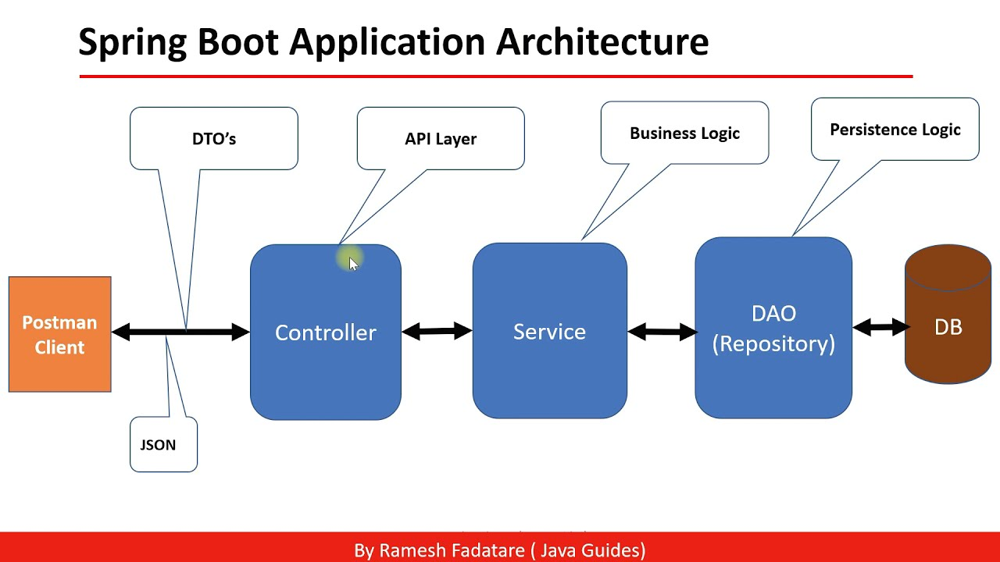

# Getting Started

>  Veja como é simples construir uma API REST com banco de dados usando Java e Spring Boot

### Pré-requisitos

- Lógica de programação (qualquer linguagem)
- Programação orientada a objetos (qualquer linguagem)
- Ferramentas
    - IntelliJ Community
    - Postman

### Objetivos da aula

- Aplicar na prática fundamentos da programação
- Criar um pequeno sistema com ferramentas e práticas de mercado
- Dar mais um passo em direção à preparação para o mercado

### Passos da aula

- Criar o projeto
- Implementar o modelo de domínio
- Mapeamento objeto-relacional com JPA
- Configurar o banco de dados H2
- Criar os endpoints da API REST

### Visão geral do sistema

Vamos construir um pequeno sistema (API REST) de usuários e departamentos, com os seguintes casos de uso:

- Buscar todos usuários
- Buscar um usuário pelo seu id
- Inserir um novo usuário
- Atualizar um usuário existente
- Deletar um usuário


### Desenvolvimento moderno: relacional -> objeto -> json


### Spring Boot Application Architecture



- o Cliente faz uma solicitação HTTP (GET, POST, PUT, DELETE...);
- O controller é responsável por expor as APIs, ele mapeia as solicitações, trata e processa os identificadores e chama os services;
- Os services recebe os dados dos controllers e executam as lógicas de negócios;
- Os services executam os métodos JPA dos modelos mapeados nos repositories para fazer as operações básicas no banco de dados;
- Repository faz o mapeamento dos modelos de dados com as tabelas no banco de dados;
- DTOs ou Entidades são os modelos de dados representados em objetos;

### Trechos de código para copiar

#### Configuração do Maven Resources Plugin

```xml
<plugin>
	<groupId>org.apache.maven.plugins</groupId>
	<artifactId>maven-resources-plugin</artifactId>
	<version>3.1.0</version>
</plugin>
```

#### Configurações do banco de dados

```
# Dados de conexão com o banco H2
spring.datasource.url=jdbc:h2:mem:testdb
spring.datasource.username=sa
spring.datasource.password=

# Configuração do cliente web do banco H2
spring.h2.console.enabled=true
spring.h2.console.path=/h2-console

# Configuração para mostrar o SQL no console
spring.jpa.show-sql=true
spring.jpa.properties.hibernate.format_sql=true
```

#### Script SQL

```sql
INSERT INTO tb_department(name) VALUES ('Gestão');
INSERT INTO tb_department(name) VALUES ('Informática');

INSERT INTO tb_user(department_id, name, email) VALUES (1, 'Maria', 'maria@gmail.com');
INSERT INTO tb_user(department_id, name, email) VALUES (1, 'Bob', 'bob@gmail.com');
INSERT INTO tb_user(department_id, name, email) VALUES (2, 'Alex', 'alex@gmail.com');
INSERT INTO tb_user(department_id, name, email) VALUES (2, 'Ana', 'ana@gmail.com');
```
